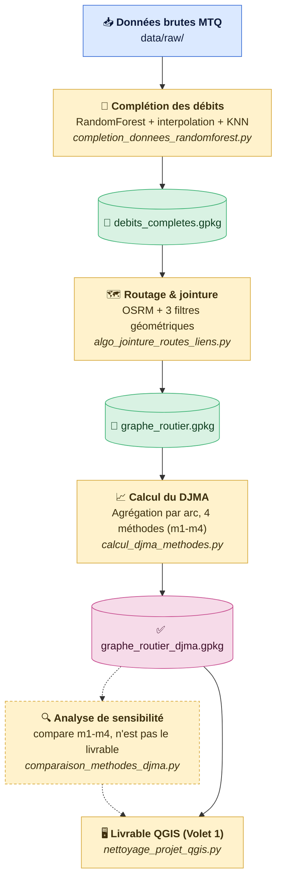

# Résilience du réseau routier québécois

Projet de recherche sur la résilience des réseaux de transport multimodaux — Polytechnique Montréal / CIRANO / Transport Canada / MTQ. Le pipeline construit un graphe routier ville-à-ville pour le Québec et l'enrichit avec des données de débit de circulation (DJMA) réelles du MTQ, en gérant les données manquantes par apprentissage automatique.

Ce dépôt couvre le **Volet 1** du projet : livrer le réseau enrichi en trafic réel (DJMA, % camions) par arc. Un **Volet 2**, hors du présent dépôt, visera à attribuer à chaque arc une valeur économique approximative à partir de plusieurs proxys — un exercice à traiter avec de très grandes précautions méthodologiques, distinct de ce qui suit.

## Sommaire

1. [Données](docs/donnees.md) — les trois couches géographiques source, et le problème de données manquantes
2. [Complétion des données](docs/completion.md) — la cascade d'imputation (interpolation, RandomForest, KNN)
3. [Routage](docs/routage.md) — jointure OSRM + réseau MTQ, 3 filtres géométriques
4. [Calcul du DJMA — 4 méthodes](docs/methodes.md) — m1 à m4, formules et écarts
5. [Résultats](docs/resultats.md) — le réseau enrichi final et ses 22 arcs en échec

## Pipeline



🔵 Donnée source · 🟡 Script Python (traitement) · 🟢 Fichier intermédiaire (GeoPackage) · 🟣 Résultat final · ┄ Analyse de sensibilité (informe le livrable, n'en est pas un second)

| Étape | Script | Rôle | Détails |
|---|---|---|---|
| 1 | `completion_donnees_randomforest.py` | Complète les débits manquants (interpolation, extrapolation, KNN géographique, RandomForest) | [Données](docs/donnees.md) · [Complétion](docs/completion.md) |
| 2 | `algo_jointure_routes_liens.py` | Route chaque paire de villes (API OSRM) et lui associe les segments DJMA pertinents via 3 filtres géométriques | [Routage](docs/routage.md) |
| 3 | `calcul_djma_methodes.py` | Agrège le DJMA par arc selon 4 méthodes (m1-m4) | [Méthodes](docs/methodes.md) |
| 4 | `comparaison_methodes_djma.py` | Analyse de sensibilité — compare les 4 méthodes (stats, corrélation, arcs divergents) pour orienter le choix éditorial ; n'est pas le livrable | [Méthodes](docs/methodes.md) |
| 5 | `nettoyage_projet_qgis.py` | Prépare le projet QGIS **livrable final du Volet 1** | [Résultats](docs/resultats.md) |

## Reproduire le pipeline

```bash
python3 scripts/completion_donnees_randomforest.py
python3 scripts/algo_jointure_routes_liens.py
python3 scripts/calcul_djma_methodes.py
python3 scripts/comparaison_methodes_djma.py
python3 scripts/nettoyage_projet_qgis.py
python3 scripts/generer_figures_resultats.py
python3 scripts/generer_figure_donnees.py
```

Le projet QGIS livrable (`qgis/reseau-routier-graphe.qgz`) utilise des chemins relatifs et s'ouvre directement après un `git clone`.
