# Résilience du réseau routier québécois

Projet de recherche sur la résilience des réseaux de transport multimodaux — Polytechnique Montréal / CIRANO / Transport Canada / MTQ. Le pipeline construit un graphe routier ville-à-ville pour le Québec et l'enrichit avec des données de débit de circulation (DJMA) réelles du MTQ, en gérant les données manquantes par apprentissage automatique.

## Pipeline

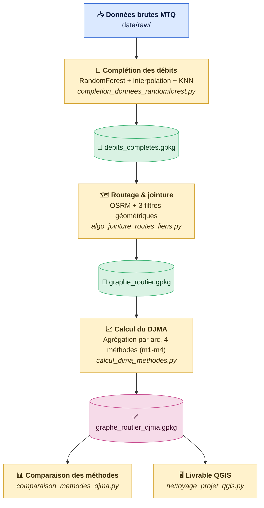

🔵 Donnée source · 🟡 Script Python (traitement) · 🟢 Fichier intermédiaire (GeoPackage) · 🟣 Résultat final

| Étape | Script | Rôle |
|---|---|---|
| 1 | `completion_donnees_randomforest.py` | Complète les débits manquants (interpolation, extrapolation, KNN géographique, RandomForest) |
| 2 | `algo_jointure_routes_liens.py` | Route chaque paire de villes (API OSRM) et lui associe les segments DJMA pertinents via 3 filtres géométriques |
| 3 | `calcul_djma_methodes.py` | Agrège le DJMA par arc selon 4 méthodes (m1-m4) |
| 4 | `comparaison_methodes_djma.py` | Compare les 4 méthodes (stats, corrélation, arcs divergents) |
| 5 | `nettoyage_projet_qgis.py` | Prépare le projet QGIS livrable |

## Données

Le projet croise trois couches géographiques distinctes, qui répondent chacune à une question différente sur le même territoire :

| Couche | Fichier | Rôle | Modifiable ? |
|---|---|---|---|
| **Nœuds et liens** | `data/raw/reseau_arcs.gpkg` (couches `noeuds`, `arcs`) | Définit *quelles villes* et *quelles paires de villes* on étudie — le graphe simplifié du projet | Oui — un simple fichier (id, nom, ville A, ville B, distance) : ajouter ou retirer une ville ne touche à rien d'autre dans le pipeline |
| **Réseau routier (RTSS)** | `data/raw/ReseauRoutier_RTSS.gpkg` (MTQ) | La géométrie détaillée des routes du Québec, avec leur classification (autoroute, nationale, régionale, collectrice…) — sert à router chaque lien sur de vraies routes | Non — donnée source du MTQ |
| **Comptage routier** | `data/raw/DebitCirculation.gpkg` (MTQ) | 7 823 stations de comptage réel, chacune avec jusqu'à 10 ans de mesures (DJMA, DJME, DJMH, % camions) | Non — donnée source du MTQ, c'est elle qui porte le problème de données manquantes |

### Réseau graphe — nœuds et liens

307 liens simplifiés relient 207 villes du Québec (municipalités, nœuds intermédiaires, points frontière). C'est le graphe étudié par le projet, indépendant des deux couches suivantes — modifiable en éditant directement `reseau_arcs.gpkg`.

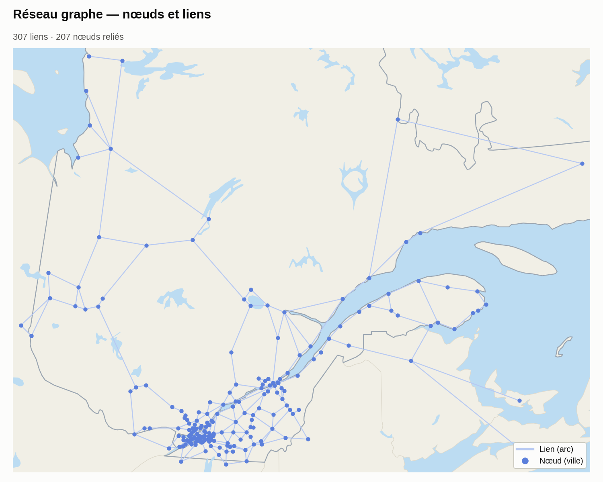

| Nœuds | Description |
|---|---|
| `ID` | Identifiant unique du nœud |
| `NOM` | Nom de la ville / municipalité |
| `TYPE` | Municipalité, nœud intermédiaire ou point frontière |
| `NB_ARCS` | Nombre de liens connectés à ce nœud |

| Arcs | Description |
|---|---|
| `ID_ARC` | Identifiant unique du lien |
| `VILLE_A` / `VILLE_B` | Les deux villes reliées par ce lien |
| `DIST_KM` | Distance à vol d'oiseau entre A et B |
| `SOURCE` | Comment la paire a été retenue (BFS, forcé, nœud, frontière) |

### Réseau routier — RTSS

Chaque lien du graphe est ensuite routé sur le réseau routier réel du MTQ — 12 567 segments classifiés par type de route — qui sert de base géométrique au routage (voir [Routage](#routage)).

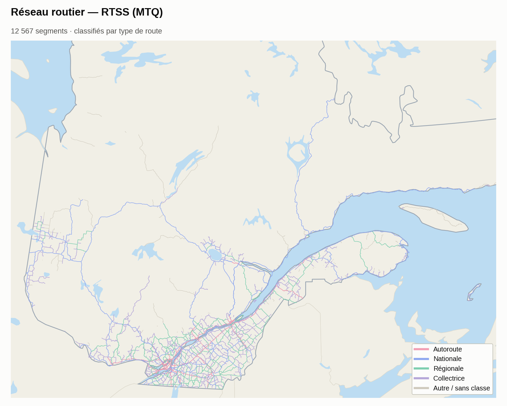

| Type de route | Segments | % |
|---|---|---|
| Autoroute | 4 222 | 33,6 % |
| Nationale | 2 859 | 22,8 % |
| Régionale | 1 581 | 12,6 % |
| Collectrice | 1 963 | 15,6 % |
| Autre / sans classe | 1 942 | 15,5 % |

### Comptage routier

Enfin, 7 823 stations de comptage MTQ portent les mesures de trafic (DJMA, % camions) qui viennent enrichir le réseau — la table brute a 110 colonnes, peu lisibles telles quelles :

| Variable | Description |
|---|---|
| `ide_sectn_trafc` | Identifiant unique du segment de comptage |
| `des_debut` / `fin_sous_route` | Description textuelle des deux extrémités |
| `djma_annee_i` / `val_djma_annee_i` | Année mesurée / valeur du DJMA (i = 1 à 10) |
| `cam_annee_i` / `val_cam_annee_i` | Année mesurée / valeur du % camions (i = 1 à 10) |

C'est ici que se loge le problème de données manquantes : seuls **34,7 %** des segments ont un DJMA complet sur 10 ans, et seulement **1,7 %** ont un % camions complet.

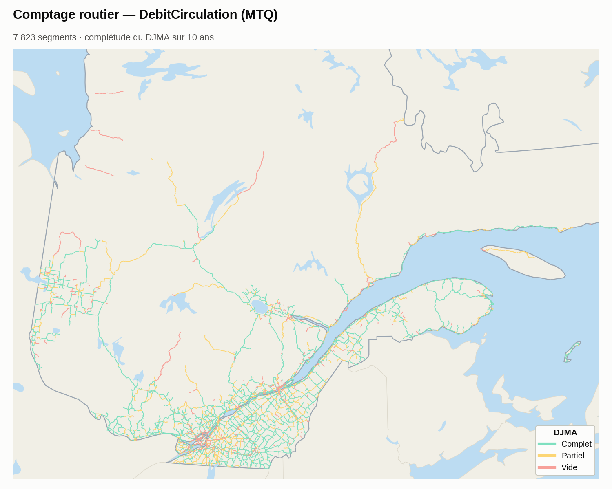

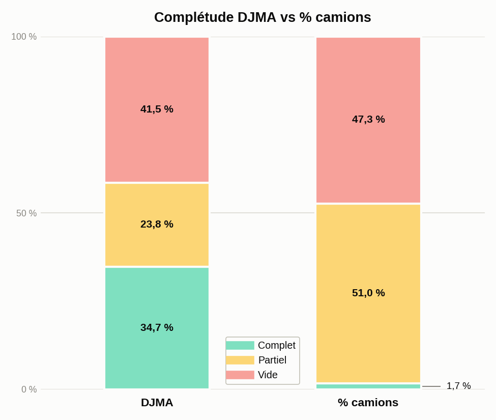

Un DJMA complet ne garantit presque jamais un % camions complet. C'est ce trou précis que la section suivante comble par apprentissage automatique.

## Complétion des données

Source : `DebitCirculation.gpkg` (MTQ), 7 823 segments routiers, chacun avec jusqu'à 10 années de mesures DJMA (débit) et %camion. Une grande partie de ces mesures sont manquantes : seuls **2 716 segments (35 %)** ont un DJMA complet sans aucun trou, et seulement **132 segments (2 %)** ont un %camion complet.

La complétion se fait en cascade, du plus fiable au plus incertain.

### 1. Interpolation / extrapolation temporelle

Les trous internes (un an manquant entouré de valeurs connues) sont comblés par interpolation linéaire. Aux deux extrémités de la plage manquante, chaque bord prolonge son propre **gradient local** — une régression sur les 3 points connus les plus proches de ce bord — plutôt qu'une tendance unique calculée sur toute la plage connue : si le début et la fin de la série n'évoluent pas dans le même sens, un bord ne doit pas hériter de la pente de l'autre.

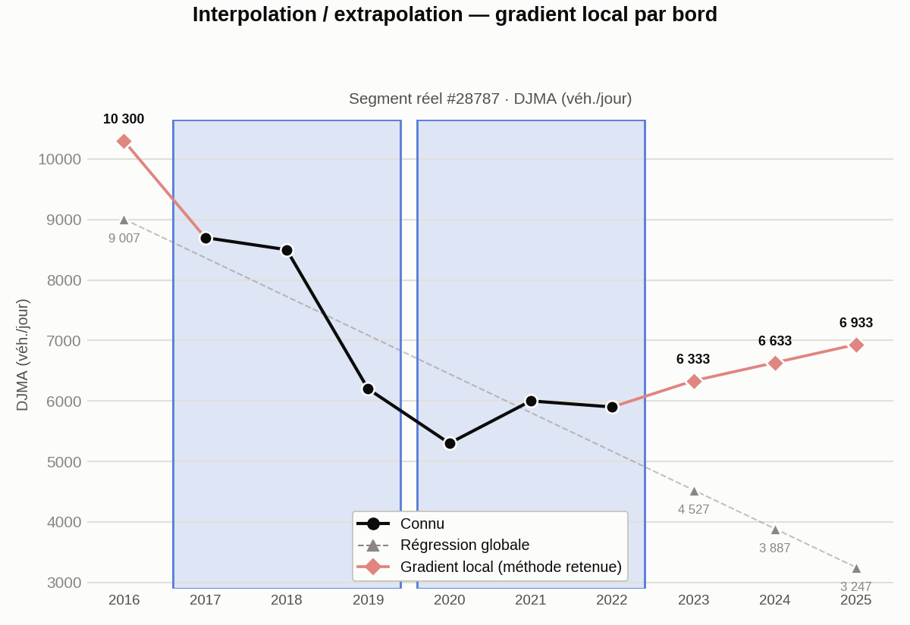

Exemple réel (segment #28787) : entre 2017 et 2022, le DJMA chute d'abord fortement (8 700 → 6 200) puis remonte légèrement (5 300 → 5 900). Une régression globale unique sur ces 6 points aurait extrapolé une pente moyenne descendante sur toute la plage — 2016 estimé à 9 007, 2025 à 3 247 — en contradiction avec la reprise observée en fin de série. En prolongeant plutôt le gradient propre à chaque bord (2017-2019 pour 2016, 2020-2022 pour 2023-2025), 2016 est estimé à 10 300 (cohérent avec la chute qui précède) et 2025 à 6 933 (cohérent avec la reprise qui suit).

### 2. RandomForest (IterativeImputer, MICE)

Pour les 910 segments avec un DJMA connu mais **aucune** valeur de %camion, un `RandomForestRegressor` (50 arbres) apprend la relation entre %camion et 38 features : le profil DJMA, les débits de pointe (DJME/DJMH), le profil horaire (30e heure), le type de route (jointure spatiale la plus proche avec le réseau RTSS — autoroute/nationale/régionale/collectrice) et la localisation géographique du segment.

**Validation honnête** (validation croisée 5-fold, hors échantillon) :

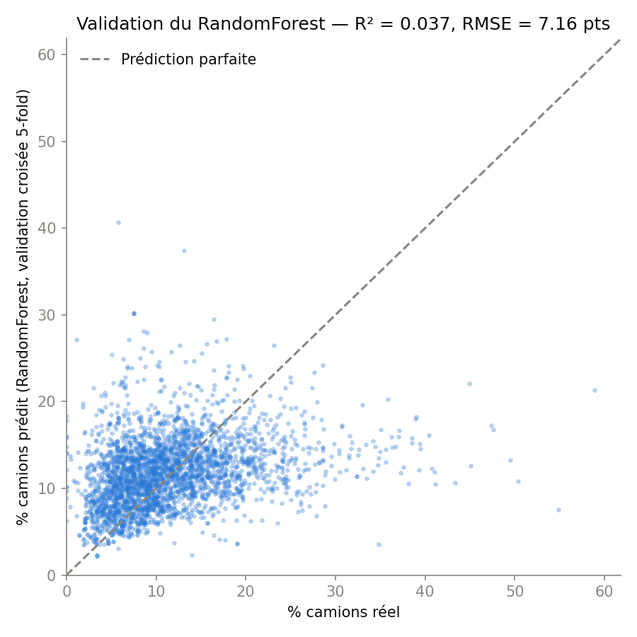

R² = 0,306, RMSE = 6,1 points. Avec le seul DJMA comme prédicteur, le modèle était peu informatif (R² = 0,037) : la corrélation brute DJMA ↔ %camion est quasi nulle (Pearson −0,13), un segment à fort débit n'étant pas nécessairement plus emprunté par les camions. En ajoutant le type de route, les débits de pointe et la localisation, le modèle capte un signal réel — le type d'axe (autoroute logistique vs route urbaine) explique une bonne part du %camion, là où le débit seul n'en disait presque rien.

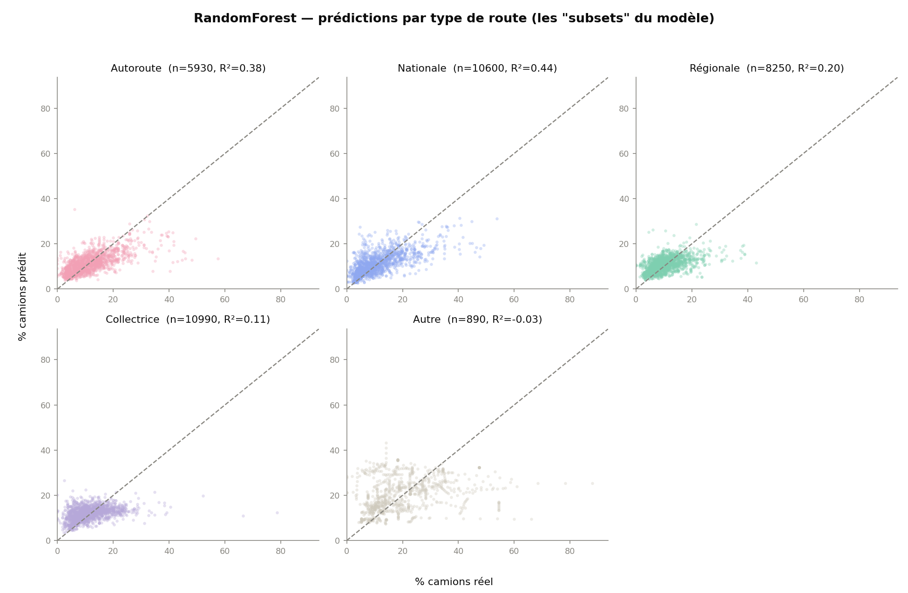

Ce signal se voit en séparant les prédictions par type de route, le "subset" le plus structurant du modèle : R² = 0,44 sur les routes nationales et 0,38 sur les autoroutes, mais seulement 0,11 sur les collectrices et −0,03 sur les segments hors classification (« Autre ») — moins bon que la moyenne. Le résultat reste donc imparfait et inégal selon le type d'axe, mais le RandomForest enrichi est un estimateur nettement plus convaincant que le modèle DJMA-seul pour ces 910 segments qui, sans lui, n'auraient aucune valeur du tout.

### 3. KNN géographique + IDW

En dernier recours, pour les segments sans aucune mesure d'aucune année, complétion par pondération inverse à la distance (IDW, poids = 1/distance²) sur les 5 stations voisines les plus proches, avec priorité aux voisins de même direction (`index_agreg`, nord/ouest).

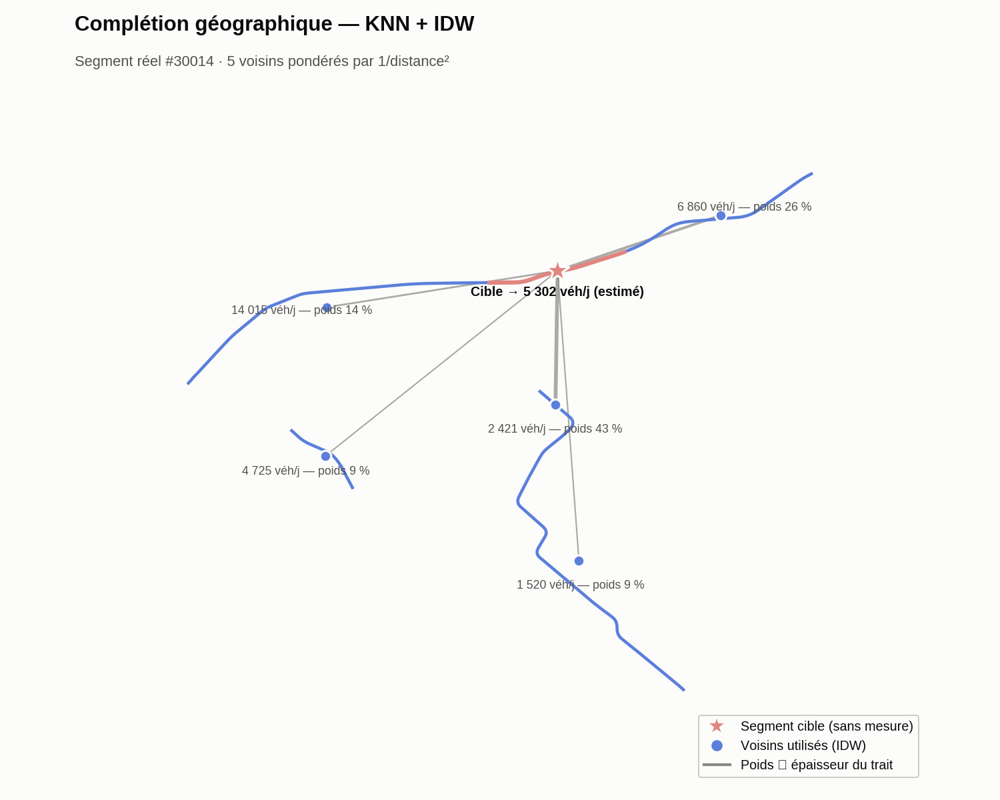

Exemple réel (segment #30014) : ses 5 voisins pondérés vont de 1 520 à 14 015 véh./jour selon leur distance — le plus proche (2 421 véh./jour, à ~1 km) pèse 43 % de l'estimation finale, le plus éloigné (14 015 véh./jour, à ~4,3 km) seulement 14 %. La valeur résultante (5 302 véh./jour) est une moyenne pondérée par cette proximité, pas une simple moyenne des 5.

### Synthèse — évolution de la complétude

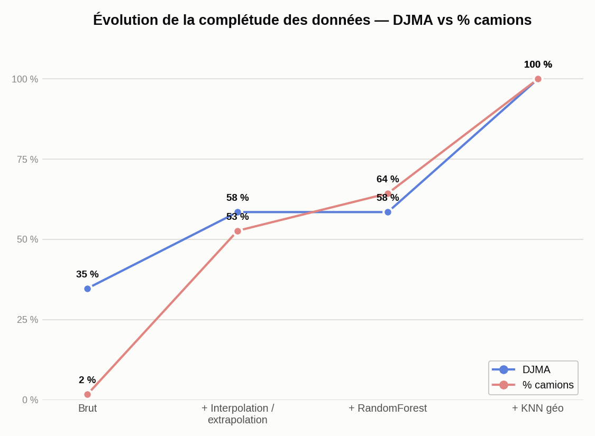

DJMA et %camion ne progressent pas au même rythme à travers la cascade : l'étape 1 comble la majorité du DJMA (35 % → 58 %) mais seulement la moitié du %camion (2 % → 53 %), faute de valeurs connues sur ces segments pour interpoler. L'étape 2 (RandomForest) est spécifique au %camion — elle ne touche jamais le DJMA, d'où le palier à 58 % sur cette courbe. L'étape 3 (KNN géographique) ferme les deux à 100 %.

## Routage

`algo_jointure_routes_liens.py` route chaque paire de villes via l'API **OSRM**, puis associe au tracé les segments du réseau MTQ (`ReseauRoutier_RTSS`) porteurs d'une mesure DJMA, filtrés en 3 passes séquentielles :

```python
def filtre_distance_trace(segs, trace, dist_max_m):
    """Filtre 1 — distance segment complet → tracé (pas du centroïde)."""
    distances = segs.geometry.distance(trace)
    return segs[distances <= dist_max_m].copy()

def filtre_direction(segs, trace, angle_max_deg):
    """Filtre 2 — alignement directionnel segment vs tracé."""
    ...
    return segs[diff_angle(angle_seg, angle_tr) <= angle_max_deg].copy()

def filtre_proximite_ab(segs, pt_a, pt_b, buffer_ab_m):
    """Filtre 3 — exclut les segments trop proches de A ou B (trafic intraurbain)."""
    ...
    return segs[not (trop_proche_de_a or trop_proche_de_b)].copy()
```

| Filtre | Seuil | Rôle |
|---|---|---|
| Distance au tracé | ≤ 400 m | Exclut les routes parallèles captées par erreur |
| Direction | ≤ 45° d'écart | Exclut les segments perpendiculaires (bretelles, croisements) |
| Exclusion intraurbaine | < 3 km de A ou B | Exclut le trafic de distribution locale près des villes d'origine/destination |

Un clip préalable au territoire québécois (buffer 2 km autour du réseau RTSS) supprime aussi les détours par d'autres provinces avant la recherche de segments DJMA.

## Calcul du DJMA — 4 méthodes

Pour chaque arc, le DJMA agrégé est calculé de 4 façons à partir de ses segments sous-jacents :

| Méthode | Logique | Médiane (véh./jour) |
|---|---|---|
| **m1** | Moyenne simple des segments | 11 947 |
| **m2** | Pondérée par longueur de segment | 14 216 |
| **m3** | Pondérée par type d'axe routier (hiérarchie MTQ) | 12 152 |
| **m4** | 80e percentile par rang (nearest-rank) : valeur réelle du segment classé à la position `round(0,8 × n)`, sans interpolation ni moyenne | 15 351 |


Plutôt qu'une simple comparaison statistique, cette carte projette l'écart relatif entre les 4 méthodes directement sur le réseau routier québécois : la couleur de chaque arc (pâle → ambre → rouge) encode son écart relatif entre m1-m4, le reste du réseau restant en trame grise pour le contexte. Un arc où les 4 méthodes s'accordent reste pâle, presque invisible ; un arc où elles divergent fortement ressort en rouge vif. Les écarts les plus marqués se situent sur des tronçons courts à faible nombre de segments contributeurs, où un seul segment extrême pèse beaucoup plus sur m4 (percentile) que sur m1-m3 (moyennes) : Laurier-Station–Saint-Apollinaire (156 %), L'Ancienne-Lorette–Nœud Lac-St-Jean (147 %), Donnacona–Saint-Augustin-de-Desmaures (142 %).

m1, m2 et m3 sont fortement corrélées entre elles (Pearson ≥ 0,979) car elles moyennent la même population de segments différemment. m4 reste bien corrélée (Pearson ≈ 0,97-0,98) tout en s'en écartant légèrement : c'est voulu, elle vise à capturer les pointes de trafic (80e percentile réel) plutôt que la tendance centrale. 134 des 307 arcs montrent un écart relatif > 30 % entre méthodes — un signal que le choix de méthode d'agrégation a un impact réel et doit être fait explicitement selon l'usage (planification vs dimensionnement).

## Résultats

L'ensemble du pipeline — complétion, routage, agrégation DJMA — transforme les 307 liens ville-à-ville du graphe de départ en un réseau routier enrichi en trafic réel, prêt à servir de base à l'analyse de résilience : **285 arcs sur 307 (92,8 %)** portent désormais une valeur DJMA fiable, construite à partir de 3 306 segments de comptage MTQ.

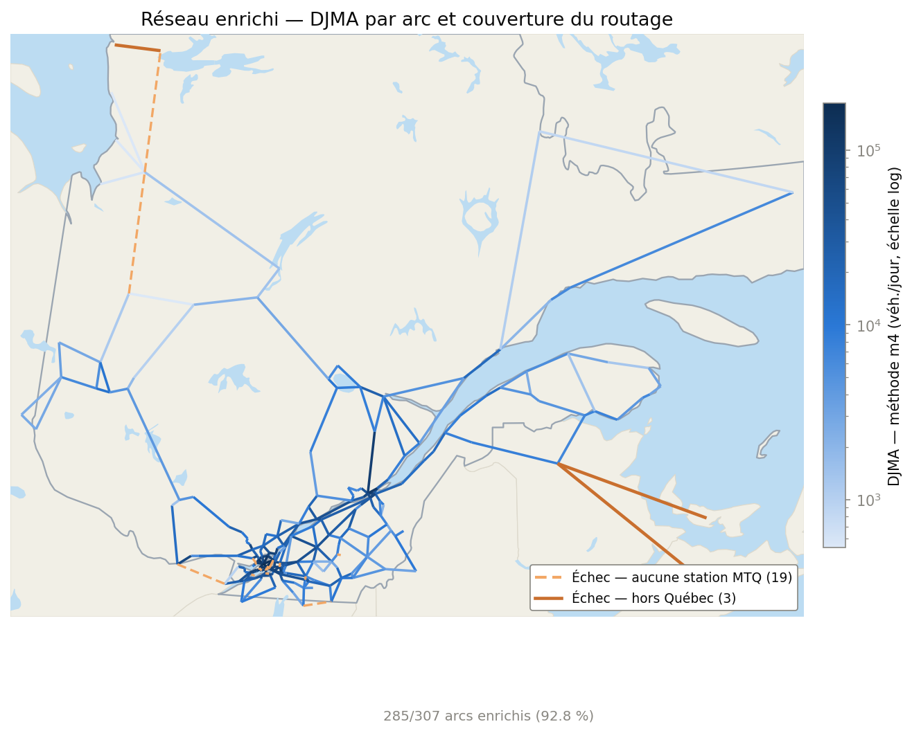

Les 22 arcs en échec ne sont pas un problème de complétion des données : la cascade d'imputation (section précédente) porte la complétude temporelle des stations MTQ *existantes* à 100 %, mais elle ne peut pas faire apparaître une station là où le MTQ n'en a jamais installé. Concrètement, 19 arcs restent sans valeur parce qu'ils empruntent un tracé purement intraurbain (surtout île de Montréal) que ne croise aucune station de comptage — le MTQ compte le réseau provincial, pas les rues municipales. Les 3 derniers sortent du territoire québécois (liaisons interprovinciales) et n'ont donc aucun segment RTSS/DJMA à associer.

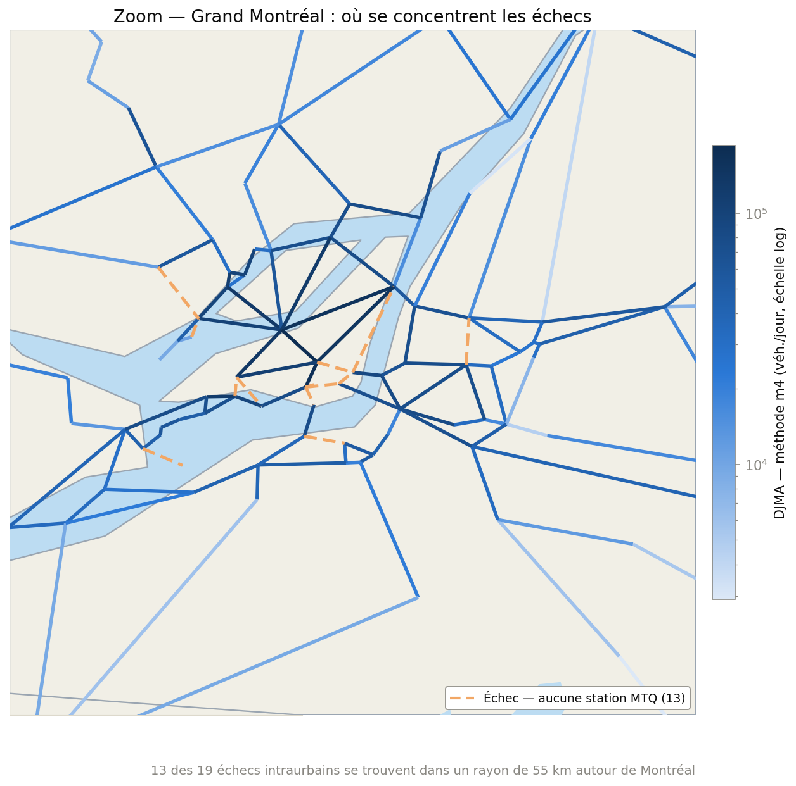

13 des 19 échecs intraurbains se concentrent dans un rayon de 55 km autour de Montréal (île, couronnes nord et sud) — trop denses pour rester lisibles à l'échelle du Québec ci-dessus. Ce zoom les isole individuellement : chacun correspond à une paire de villes limitrophes (ex. Pointe-Claire–Dollard-des-Ormeaux, Hampstead–Côte-Saint-Luc) où le tracé le plus court ne croise jamais le réseau provincial compté par le MTQ.

| Indicateur | Valeur |
|---|---|
| Arcs enrichis | 285 / 307 (92,8 %) |
| Segments DJMA mobilisés | 3 306 (médiane 8 par arc) |
| Longueur de tracé médiane | 25,8 km (couverte à 24,9 km par le RTSS québécois) |
| Échecs — intraurbain, aucune station MTQ | 19 |
| Échecs — hors territoire québécois | 3 |

## Reproduire le pipeline

```bash
python3 scripts/completion_donnees_randomforest.py
python3 scripts/algo_jointure_routes_liens.py
python3 scripts/calcul_djma_methodes.py
python3 scripts/comparaison_methodes_djma.py
python3 scripts/nettoyage_projet_qgis.py
python3 scripts/generer_figures_resultats.py
python3 scripts/generer_figure_donnees.py
```

Le projet QGIS livrable (`qgis/reseau-routier-graphe.qgz`) utilise des chemins relatifs et s'ouvre directement après un `git clone`.
