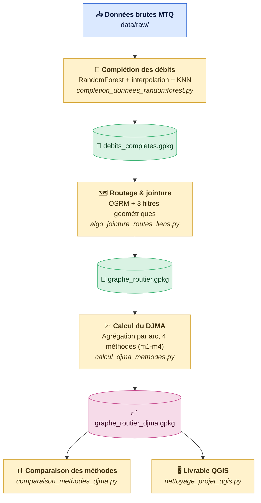
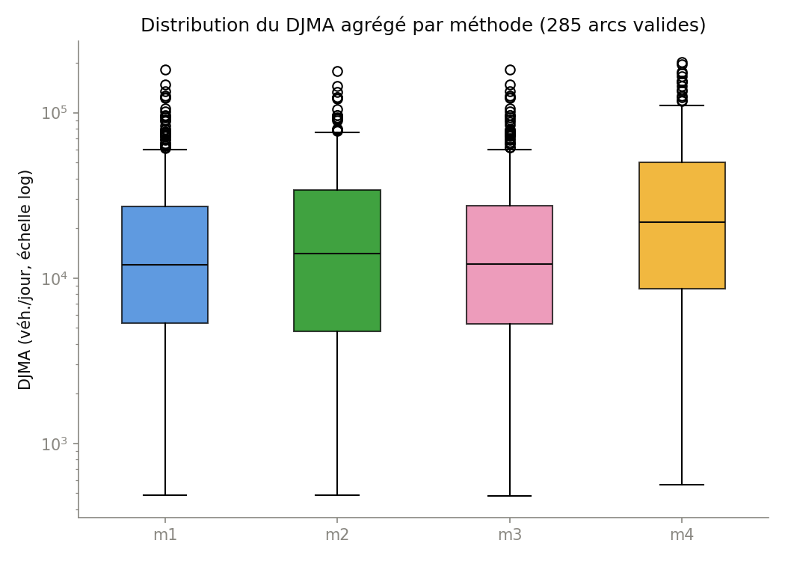
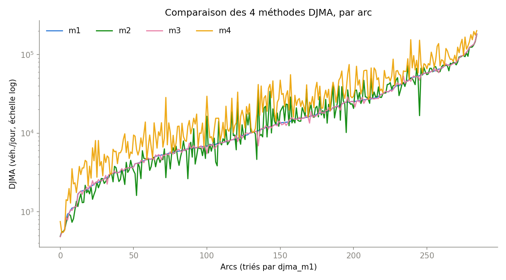
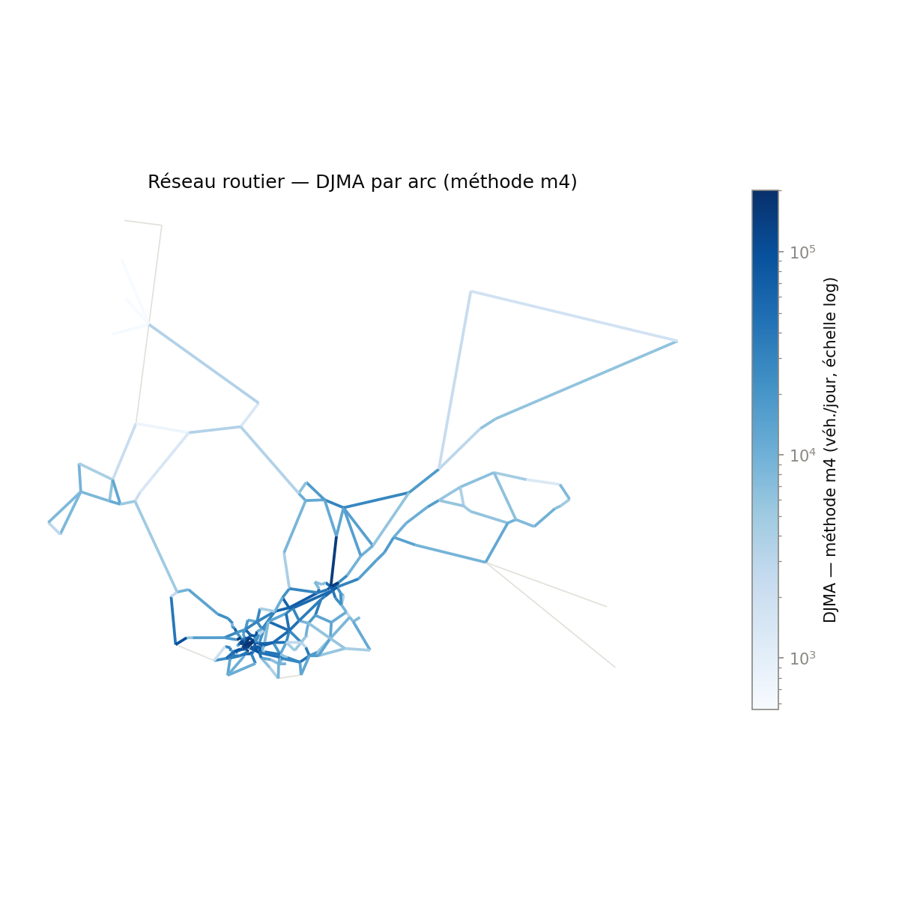
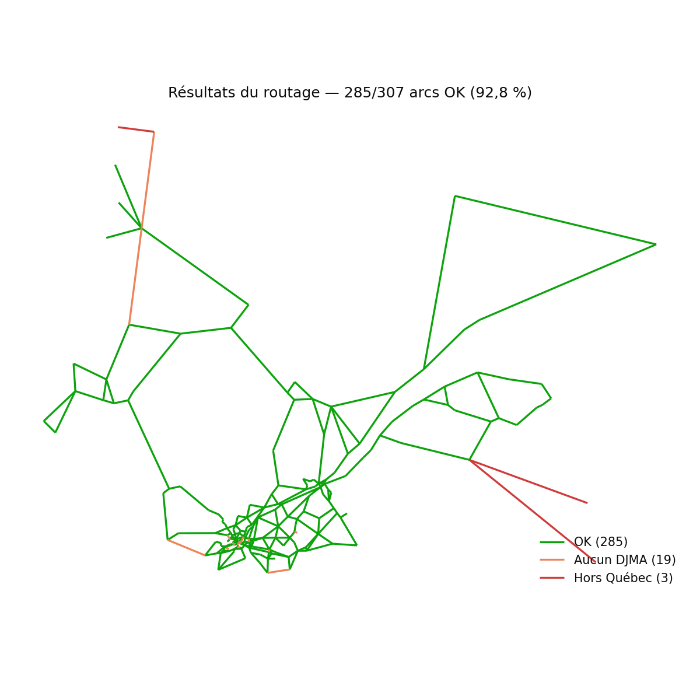

# Résilience du réseau routier québécois

Projet de recherche sur la résilience des réseaux de transport multimodaux — Polytechnique Montréal / CIRANO / Transport Canada / MTQ. Le pipeline construit un graphe routier ville-à-ville pour le Québec et l'enrichit avec des données de débit de circulation (DJMA) réelles du MTQ, en gérant les données manquantes par apprentissage automatique.

## Pipeline



🔵 Donnée source · 🟡 Script Python (traitement) · 🟢 Fichier intermédiaire (GeoPackage) · 🟣 Résultat final

| Étape | Script | Rôle |
|---|---|---|
| 1 | `completion_donnees_randomforest.py` | Complète les débits manquants (interpolation, extrapolation, KNN géographique, RandomForest) |
| 2 | `algo_jointure_routes_liens.py` | Route chaque paire de villes (API OSRM) et lui associe les segments DJMA pertinents via 3 filtres géométriques |
| 3 | `calcul_djma_methodes.py` | Agrège le DJMA par arc selon 4 méthodes (m1-m4) |
| 4 | `comparaison_methodes_djma.py` | Compare les 4 méthodes (stats, corrélation, arcs divergents) |
| 5 | `nettoyage_projet_qgis.py` | Prépare le projet QGIS livrable |

## Données

Le projet croise trois couches géographiques distinctes, qui répondent chacune à une question différente sur le même territoire :

| Couche | Fichier | Rôle | Modifiable ? |
|---|---|---|---|
| **Nœuds et liens** | `data/raw/reseau_arcs.gpkg` (couches `noeuds`, `arcs`) | Définit *quelles villes* et *quelles paires de villes* on étudie — le graphe simplifié du projet | Oui — un simple fichier (id, nom, ville A, ville B, distance) : ajouter ou retirer une ville ne touche à rien d'autre dans le pipeline |
| **Réseau routier (RTSS)** | `data/raw/ReseauRoutier_RTSS.gpkg` (MTQ) | La géométrie détaillée des routes du Québec, avec leur classification (autoroute, nationale, régionale, collectrice…) — sert à router chaque lien sur de vraies routes | Non — donnée source du MTQ |
| **Comptage routier** | `data/raw/DebitCirculation.gpkg` (MTQ) | 7 823 stations de comptage réel, chacune avec jusqu'à 10 ans de mesures (DJMA, DJME, DJMH, % camions) | Non — donnée source du MTQ, c'est elle qui porte le problème de données manquantes |

### Réseau graphe — nœuds et liens

307 liens simplifiés relient 207 villes du Québec (municipalités, nœuds intermédiaires, points frontière). C'est le graphe étudié par le projet, indépendant des deux couches suivantes — modifiable en éditant directement `reseau_arcs.gpkg`.


| Nœuds | Description |
|---|---|
| `ID` | Identifiant unique du nœud |
| `NOM` | Nom de la ville / municipalité |
| `TYPE` | Municipalité, nœud intermédiaire ou point frontière |
| `NB_ARCS` | Nombre de liens connectés à ce nœud |

| Arcs | Description |
|---|---|
| `ID_ARC` | Identifiant unique du lien |
| `VILLE_A` / `VILLE_B` | Les deux villes reliées par ce lien |
| `DIST_KM` | Distance à vol d'oiseau entre A et B |
| `SOURCE` | Comment la paire a été retenue (BFS, forcé, nœud, frontière) |

### Réseau routier — RTSS

Chaque lien du graphe est ensuite routé sur le réseau routier réel du MTQ — 12 567 segments classifiés par type de route — qui sert de base géométrique au routage (voir [Routage](#routage)).


| Type de route | Segments | % |
|---|---|---|
| Autoroute | 4 222 | 33,6 % |
| Nationale | 2 859 | 22,8 % |
| Régionale | 1 581 | 12,6 % |
| Collectrice | 1 963 | 15,6 % |
| Autre / sans classe | 1 942 | 15,5 % |

### Comptage routier

Enfin, 7 823 stations de comptage MTQ portent les mesures de trafic (DJMA, % camions) qui viennent enrichir le réseau — la table brute a 110 colonnes, peu lisibles telles quelles :

| Variable | Description |
|---|---|
| `ide_sectn_trafc` | Identifiant unique du segment de comptage |
| `des_debut` / `fin_sous_route` | Description textuelle des deux extrémités |
| `djma_annee_i` / `val_djma_annee_i` | Année mesurée / valeur du DJMA (i = 1 à 10) |
| `cam_annee_i` / `val_cam_annee_i` | Année mesurée / valeur du % camions (i = 1 à 10) |

C'est ici que se loge le problème de données manquantes : seuls **34,7 %** des segments ont un DJMA complet sur 10 ans, et seulement **1,7 %** ont un % camions complet.


Un DJMA complet ne garantit presque jamais un % camions complet. C'est ce trou précis que la section suivante comble par apprentissage automatique.

## Données & Random Forest

Source : `DebitCirculation.gpkg` (MTQ), 7 823 segments routiers, chacun avec jusqu'à 10 années de mesures DJMA (débit) et %camion. Une grande partie de ces mesures sont manquantes : seuls **2 716 segments (35 %)** ont un DJMA complet sans aucun trou, et seulement **132 segments (2 %)** ont un %camion complet.

La complétion se fait en cascade, du plus fiable au plus incertain :
1. **Interpolation / extrapolation temporelle** — pour un segment avec au moins une valeur connue, on comble les trous par régression sur ses propres années.
2. **RandomForest (IterativeImputer, MICE)** — pour les 910 segments avec un DJMA connu mais **aucune** valeur de %camion, un `RandomForestRegressor` (50 arbres) apprend la relation DJMA ↔ %camion sur les segments complets et prédit le %camion manquant.
3. **KNN géographique + IDW** — en dernier recours, pour les segments sans aucune mesure, complétion par les stations voisines.

**Validation honnête du RandomForest** (validation croisée 5-fold, hors échantillon) :


R² = 0,037 — la corrélation brute entre DJMA et %camion dans les données est en fait très faible (Pearson −0,13). Ce n'est pas un défaut du modèle : un segment à fort débit n'est pas nécessairement emprunté davantage par les camions (ça dépend plutôt du type d'axe — autoroute logistique vs route urbaine). Le RandomForest reste néanmoins le meilleur estimateur disponible pour ces 910 segments qui, sans lui, n'auraient aucune valeur du tout ; il est utilisé en toute connaissance de cause comme méthode de dernier recours, pas comme modèle prédictif à haute précision.

## Routage

`algo_jointure_routes_liens.py` route chaque paire de villes via l'API **OSRM**, puis associe au tracé les segments du réseau MTQ (`ReseauRoutier_RTSS`) porteurs d'une mesure DJMA, filtrés en 3 passes séquentielles :

```python
def filtre_distance_trace(segs, trace, dist_max_m):
    """Filtre 1 — distance segment complet → tracé (pas du centroïde)."""
    distances = segs.geometry.distance(trace)
    return segs[distances <= dist_max_m].copy()

def filtre_direction(segs, trace, angle_max_deg):
    """Filtre 2 — alignement directionnel segment vs tracé."""
    ...
    return segs[diff_angle(angle_seg, angle_tr) <= angle_max_deg].copy()

def filtre_proximite_ab(segs, pt_a, pt_b, buffer_ab_m):
    """Filtre 3 — exclut les segments trop proches de A ou B (trafic intraurbain)."""
    ...
    return segs[not (trop_proche_de_a or trop_proche_de_b)].copy()
```

| Filtre | Seuil | Rôle |
|---|---|---|
| Distance au tracé | ≤ 400 m | Exclut les routes parallèles captées par erreur |
| Direction | ≤ 45° d'écart | Exclut les segments perpendiculaires (bretelles, croisements) |
| Exclusion intraurbaine | < 3 km de A ou B | Exclut le trafic de distribution locale près des villes d'origine/destination |

Un clip préalable au territoire québécois (buffer 2 km autour du réseau RTSS) supprime aussi les détours par d'autres provinces avant la recherche de segments DJMA.

## Calcul du DJMA — 4 méthodes

Pour chaque arc, le DJMA agrégé est calculé de 4 façons à partir de ses segments sous-jacents :

| Méthode | Logique | Médiane (véh./jour) |
|---|---|---|
| **m1** | Moyenne simple des segments | 12 012 |
| **m2** | Pondérée par longueur de segment | 14 092 |
| **m3** | Pondérée par type d'axe routier (hiérarchie MTQ) | 12 152 |
| **m4** | Approximation du 90e percentile : `0,9 × max + 0,1 × mean` | 21 821 |




m1, m2 et m3 sont fortement corrélées entre elles (Pearson ≥ 0,979) car elles moyennent la même population de segments différemment. m4 s'en écarte davantage (Pearson ≈ 0,93-0,94) : c'est voulu, elle vise à capturer les pointes de trafic plutôt que la tendance centrale. 207 des 307 arcs montrent un écart relatif > 30 % entre méthodes — un signal que le choix de méthode d'agrégation a un impact réel et doit être fait explicitement selon l'usage (planification vs dimensionnement).

## Résultats & faits saillants




- **285 / 307 arcs (92,8 %)** ont été enrichis avec succès en données DJMA.
- **22 échecs** : 19 arcs ultra-courts intraurbains sans station MTQ à proximité (surtout île de Montréal), et 3 arcs sortant du territoire québécois (liaisons interprovinciales).
- **3 306 segments DJMA** contribuent aux 285 arcs enrichis, avec une médiane de 8 segments par arc.
- Longueur de tracé médiane : 24,8 km ; longueur couverte par le réseau RTSS québécois : 23,1 km (couverture quasi complète du tracé).

## Reproduire le pipeline

```bash
python3 scripts/completion_donnees_randomforest.py
python3 scripts/algo_jointure_routes_liens.py
python3 scripts/calcul_djma_methodes.py
python3 scripts/comparaison_methodes_djma.py
python3 scripts/nettoyage_projet_qgis.py
python3 scripts/generer_figures_resultats.py
python3 scripts/generer_figure_donnees.py
```

Le projet QGIS livrable (`qgis/reseau-routier-graphe.qgz`) utilise des chemins relatifs et s'ouvre directement après un `git clone`.
