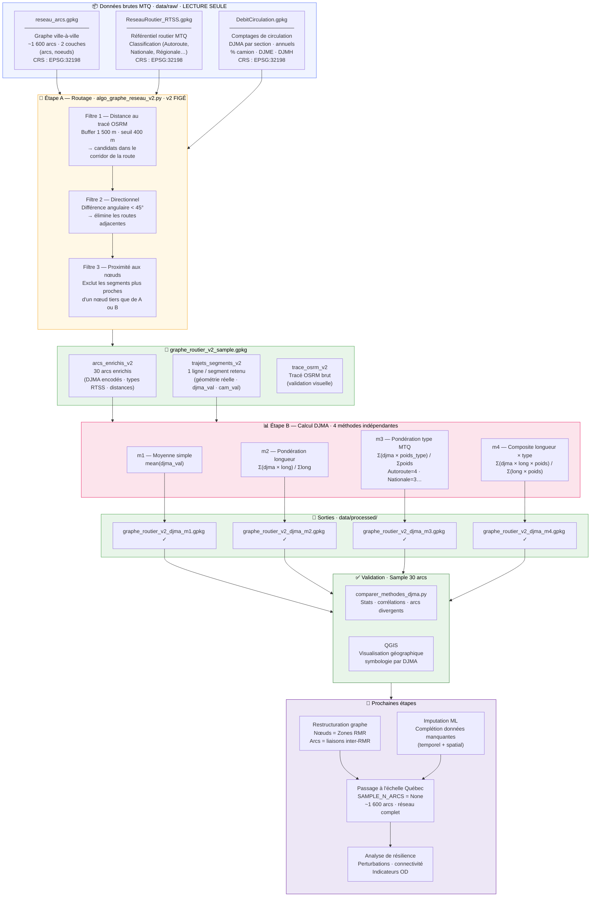

# Architecture du pipeline — Résilience réseau routier québécois
**Projet CIRANO II** | Polytechnique Montréal / CIRANO / MTQ  
**Chercheur :** Akram Bouznad | **Mise à jour :** 2026-06-13

---

## Vue d'ensemble



---

## Légende des étapes

| Étape | Script | Statut | Sortie |
|---|---|---|---|
| **A — Routage v2** | `algo_graphe_reseau_v2.py` | ✅ Figé, validé QGIS | `graphe_routier_v2_sample.gpkg` |
| **B1 — DJMA m1** | `calcul_djma_m1.py` | ✅ Produit | `graphe_routier_v2_djma_m1.gpkg` |
| **B2 — DJMA m2** | `calcul_djma_m2.py` | ✅ Produit | `graphe_routier_v2_djma_m2.gpkg` |
| **B3 — DJMA m3** | `calcul_djma_m3.py` | ✅ Produit | `graphe_routier_v2_djma_m3.gpkg` |
| **B4 — DJMA m4** | `calcul_djma_m4.py` | ✅ Produit | `graphe_routier_v2_djma_m4.gpkg` |
| **Validation** | `comparer_methodes_djma.py` + QGIS | ✅ Fait (30 arcs, corrél. > 0.97) | — |
| **Nœuds RMR** | À définir | 🔜 Prochaine session | `reseau_arcs_rmr.gpkg` |
| **Imputation ML** | À développer | 🔜 Prochaine session | `djma_complet_ml.gpkg` |
| **Échelle Québec** | `algo_graphe_reseau_v2.py` (`SAMPLE_N_ARCS=None`) | 🔜 Après validation RMR | `graphe_routier_v2_full.gpkg` |
| **Résilience** | À développer | 🔮 Phase finale | Indicateurs OD · rapports |

---

## Convention de nommage des fichiers

```
graphe_routier_v{routage}_djma_m{méthode}.gpkg
                  │                  │
                  └── v2 : figé      └── m1 à m4 : méthodes d'agrégation
```

**Axes indépendants** — changer la méthode DJMA ne touche pas au routage, et vice-versa.
