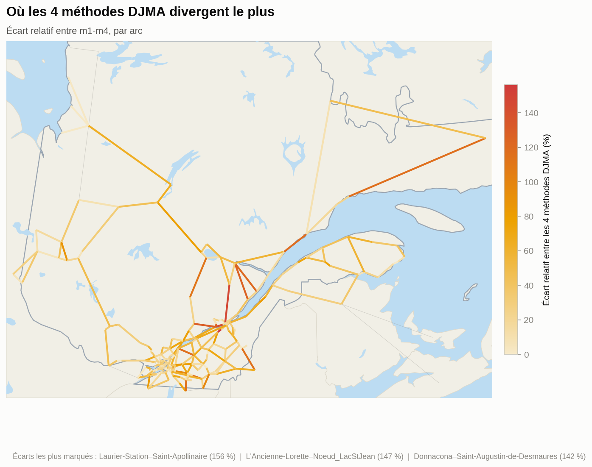

[← Routage](routage.md) · **Méthodes** · [Résultats →](resultats.md) · [README](../README.md)

---

## Calcul du DJMA — 4 méthodes

Pour chaque arc, le DJMA agrégé est calculé de 4 façons à partir de ses segments sous-jacents :

| Méthode | Logique | Médiane (véh./jour) |
|---|---|---|
| **m1** | Moyenne simple des segments | 11 947 |
| **m2** | Pondérée par longueur de segment | 14 216 |
| **m3** | Pondérée par type d'axe routier (hiérarchie MTQ) | 12 152 |
| **m4** | 80e percentile par rang (nearest-rank) : valeur réelle du segment classé à la position `round(0,8 × n)`, sans interpolation ni moyenne | 15 351 |

```python
def calculer_m1(segments):
    """m1 — Moyenne simple des DJMA des segments sous-jacents."""
    return moyenne([s.djma for s in segments])

def calculer_m2(segments):
    """m2 — Moyenne pondérée par longueur de segment (mètres)."""
    poids = [s.longueur_m for s in segments]
    return moyenne_ponderee([s.djma for s in segments], poids)

def calculer_m3(segments):
    """m3 — Moyenne pondérée par type d'axe (hiérarchie fonctionnelle MTQ)."""
    poids_type = {"Autoroute": 4, "Nationale": 3, "Régionale": 2, "Collectrice": 2, "Autre": 1}
    poids = [poids_type.get(s.type_route, 1) for s in segments]
    return moyenne_ponderee([s.djma for s in segments], poids)

def calculer_m4(segments, percentile=0.80):
    """m4 — 80e percentile par rang (nearest-rank) : valeur RÉELLE d'un segment, jamais interpolée."""
    tries = sorted(segments, key=lambda s: s.djma)
    rang  = min(max(round(percentile * len(tries)), 1), len(tries))
    return tries[rang - 1].djma
```



Plutôt qu'une simple comparaison statistique, cette carte projette l'écart relatif entre les 4 méthodes directement sur le réseau routier québécois : la couleur de chaque arc (pâle → ambre → rouge) encode son écart relatif entre m1-m4, le reste du réseau restant en trame grise pour le contexte. Un arc où les 4 méthodes s'accordent reste pâle, presque invisible ; un arc où elles divergent fortement ressort en rouge vif. Les écarts les plus marqués se situent sur des tronçons courts à faible nombre de segments contributeurs, où un seul segment extrême pèse beaucoup plus sur m4 (percentile) que sur m1-m3 (moyennes) : Laurier-Station–Saint-Apollinaire (156 %), L'Ancienne-Lorette–Nœud Lac-St-Jean (147 %), Donnacona–Saint-Augustin-de-Desmaures (142 %).

m1, m2 et m3 sont fortement corrélées entre elles (Pearson ≥ 0,979) car elles moyennent la même population de segments différemment. m4 reste bien corrélée (Pearson ≈ 0,97-0,98) tout en s'en écartant légèrement : c'est voulu, elle vise à capturer les pointes de trafic (80e percentile réel) plutôt que la tendance centrale. 134 des 307 arcs montrent un écart relatif > 30 % entre méthodes — un signal que le choix de méthode d'agrégation a un impact réel et doit être fait explicitement selon l'usage (planification vs dimensionnement).

---

[← Routage](routage.md) · [Résultats →](resultats.md) · [README](../README.md)
