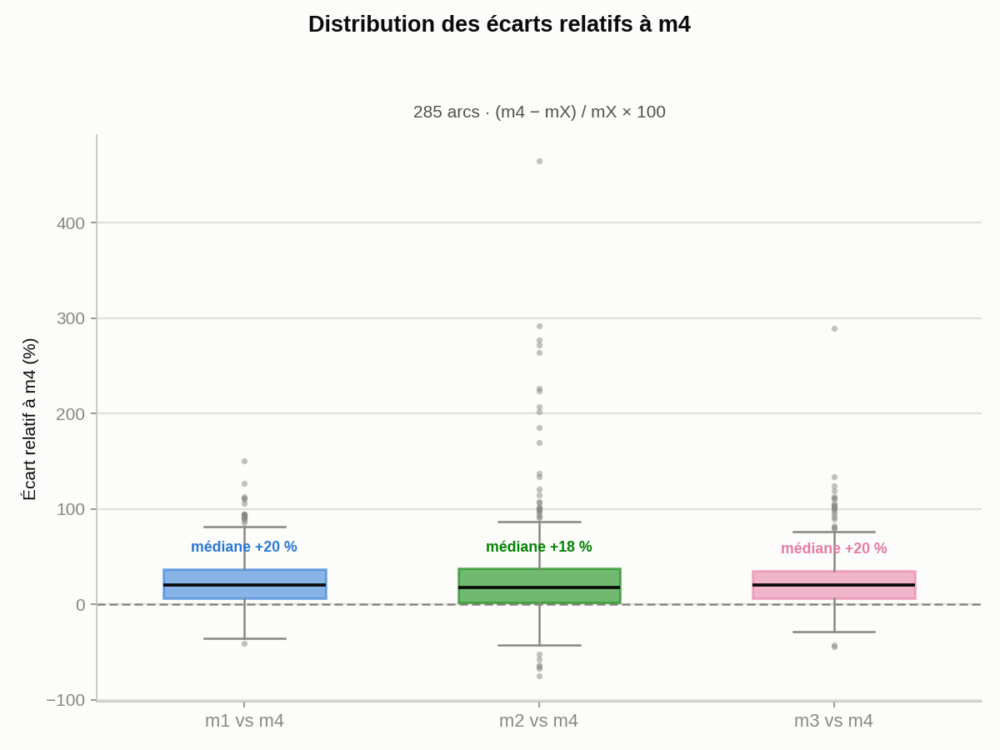

[← Routage](routage.md) · **Méthodes** · [Résultats →](resultats.md) · [README](../README.md)

---

## Calcul du DJMA — 4 méthodes

Pour chaque arc, le DJMA agrégé est calculé de 4 façons à partir de ses segments sous-jacents :

| Méthode | Logique | Médiane (véh./jour) |
|---|---|---|
| **m1** | Moyenne simple des segments | 11 947 |
| **m2** | Pondérée par longueur de segment | 14 216 |
| **m3** | Pondérée par type d'axe routier (hiérarchie MTQ) | 12 152 |
| **m4** | 80e percentile par rang (nearest-rank) : valeur réelle du segment classé à la position `round(0,8 × n)`, sans interpolation ni moyenne | 15 351 |

```python
def calculer_m1(segments):
    """m1 — Moyenne simple des DJMA des segments sous-jacents."""
    return moyenne([s.djma for s in segments])

def calculer_m2(segments):
    """m2 — Moyenne pondérée par longueur de segment (mètres)."""
    poids = [s.longueur_m for s in segments]
    return moyenne_ponderee([s.djma for s in segments], poids)

def calculer_m3(segments):
    """m3 — Moyenne pondérée par type d'axe (hiérarchie fonctionnelle MTQ)."""
    poids_type = {"Autoroute": 4, "Nationale": 3, "Régionale": 2, "Collectrice": 2, "Autre": 1}
    poids = [poids_type.get(s.type_route, 1) for s in segments]
    return moyenne_ponderee([s.djma for s in segments], poids)

def calculer_m4(segments, percentile=0.80):
    """m4 — 80e percentile par rang (nearest-rank) : valeur RÉELLE d'un segment, jamais interpolée."""
    tries = sorted(segments, key=lambda s: s.djma)
    rang  = min(max(round(percentile * len(tries)), 1), len(tries))
    return tries[rang - 1].djma
```


Plutôt qu'une simple comparaison statistique, cette carte projette l'écart relatif entre les 4 méthodes directement sur le réseau routier québécois : la couleur de chaque arc (pâle → ambre → rouge) encode son écart relatif entre m1-m4, le reste du réseau restant en trame grise pour le contexte. Un arc où les 4 méthodes s'accordent reste pâle, presque invisible ; un arc où elles divergent fortement ressort en rouge vif. Les écarts les plus marqués se situent sur des tronçons courts à faible nombre de segments contributeurs, où un seul segment extrême pèse beaucoup plus sur m4 (percentile) que sur m1-m3 (moyennes) : Laurier-Station–Saint-Apollinaire (156 %), L'Ancienne-Lorette–Nœud Lac-St-Jean (147 %), Donnacona–Saint-Augustin-de-Desmaures (142 %).



La carte montre *où* ça diverge ; ce graphique montre *de combien*, en distribution, sur les mêmes 285 arcs (les 19 arcs complétés géographiquement en sont exclus — voir plus bas). m4 sert de référence commune aux trois boîtes puisque c'est la méthode qui s'écarte le plus des trois autres. Les trois médianes sont proches (+18 % à +20 %) : m4 dépasse typiquement m1-m3 d'environ un cinquième, cohérent avec son rôle de capter un 80e percentile plutôt qu'une tendance centrale. Les distributions sont étalées vers le haut (quelques arcs dépassent +100 %, un extrême à +465 % pour m2) mais rarement négatives au-delà de −40/−75 % : m4 est presque toujours ≥ aux moyennes, jamais dramatiquement en-dessous.

m1, m2 et m3 sont fortement corrélées entre elles (Pearson ≥ 0,979) car elles moyennent la même population de segments différemment. m4 reste bien corrélée (Pearson ≈ 0,97-0,98) tout en s'en écartant légèrement : c'est voulu, elle vise à capturer les pointes de trafic (80e percentile réel) plutôt que la tendance centrale. 134 des 307 arcs montrent un écart relatif > 30 % entre méthodes — un signal que le choix de méthode d'agrégation a un impact réel et doit être fait explicitement selon l'usage (planification vs dimensionnement).

### Complétion géographique des échecs

19 des 307 arcs (statut `aucun_djma` — aucune station MTQ à proximité du tracé, cf. [Routage](routage.md)) n'ont aucun segment propre : m1-m4 y sont indéfinis par construction, faute de mesure à agréger. Plutôt que de laisser ces arcs vides, `completer_echecs_geographique()` leur emprunte le DJMA (m1-m4) de l'arc valide le plus proche géométriquement.

```python
def completer_echecs_geographique(arcs):
    """Emprunte le DJMA de l'arc valide (statut == 'ok') le plus proche."""
    valides = arcs[arcs.statut == "ok"]
    for arc in arcs[arcs.statut == "aucun_djma"]:
        distances   = valides.geometry.distance(arc.geometry)  # tracé à tracé
        plus_proche = valides[argmin(distances)]
        arc.djma_m1, arc.djma_m2, arc.djma_m3, arc.djma_m4 = (
            plus_proche.djma_m1, plus_proche.djma_m2, plus_proche.djma_m3, plus_proche.djma_m4
        )
        arc.djma_complete, arc.djma_arc_source = True, plus_proche.ID_ARC
        # n_segs_m{N} reste à 0 : toujours aucun segment MTQ propre à cet arc
```

Un seul plus proche voisin — pas de moyenne pondérée façon KNN+IDW (cf. [Complétion](completion.md)) : il n'existe ici aucune mesure partielle à compléter, seulement une meilleure estimation à emprunter. La distance au donneur est **0 km dans les 19 cas** : le plus proche voisin géométrique d'un arc est presque toujours un arc qui lui est directement connecté dans le graphe (même ville de départ ou d'arrivée), pas un arc choisi par proximité de coordonnées au sens large. Ex. Noeud_Baie_James–Radisson (aucune mesure) emprunte à Wemindji–Noeud_Baie_James, le corridor adjacent qui partage son nœud "Noeud_Baie_James" ; Montréal–Westmount emprunte à Montréal–Saint-Lambert.

Chaque valeur empruntée reste traçable — `djma_complete = True`, `djma_arc_source` (ID de l'arc donneur) et `djma_distance_source_km` sont conservés dans `graphe_routier_djma.gpkg` — pour ne jamais confondre une mesure réelle avec une estimation empruntée en aval (cartes, statistiques). Les 3 arcs `hors_quebec` (tracé sortant du territoire) ne sont pas concernés : leur géométrie elle-même est hors du réseau QC comparé, la proximité y est moins interprétable.

---

[← Routage](routage.md) · [Résultats →](resultats.md) · [README](../README.md)
