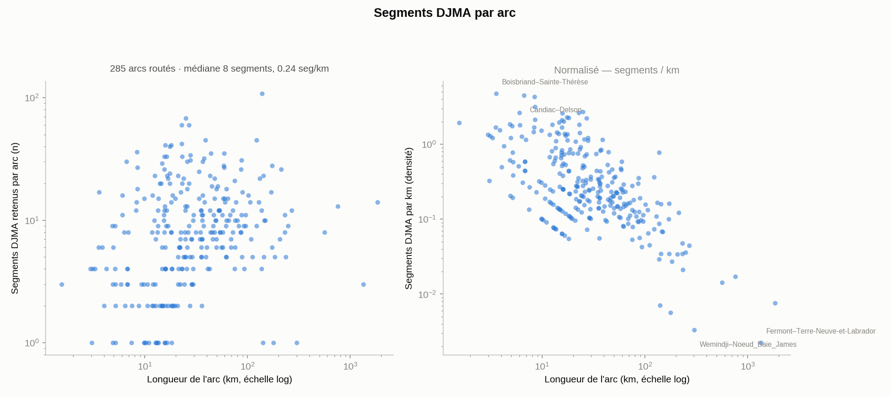

[← Complétion](completion.md) · **Routage** · [Méthodes →](methodes.md) · [README](../README.md)

---

## Routage

`algo_jointure_routes_liens.py` route chaque paire de villes via l'API **OSRM**, puis associe au tracé les segments du réseau MTQ (`ReseauRoutier_RTSS`) porteurs d'une mesure DJMA, filtrés en 3 passes séquentielles :

```python
def filtre_distance_trace(segs, trace, dist_max_m):
    """Filtre 1 — distance segment complet → tracé (pas du centroïde)."""
    distances = segs.geometry.distance(trace)
    return segs[distances <= dist_max_m].copy()

def filtre_direction(segs, trace, angle_max_deg):
    """Filtre 2 — alignement directionnel segment vs tracé."""
    ...
    return segs[diff_angle(angle_seg, angle_tr) <= angle_max_deg].copy()

def filtre_proximite_ab(segs, pt_a, pt_b, buffer_ab_m):
    """Filtre 3 — exclut les segments trop proches de A ou B (trafic intraurbain)."""
    ...
    return segs[not (trop_proche_de_a or trop_proche_de_b)].copy()
```

| Filtre | Seuil | Rôle |
|---|---|---|
| Distance au tracé | ≤ 400 m | Exclut les routes parallèles captées par erreur |
| Direction | ≤ 45° d'écart | Exclut les segments perpendiculaires (bretelles, croisements) |
| Exclusion intraurbaine | < 3 km de A ou B | Exclut le trafic de distribution locale près des villes d'origine/destination |

Un clip préalable au territoire québécois (buffer 2 km autour du réseau RTSS) supprime aussi les détours par d'autres provinces avant la recherche de segments DJMA.

### Segments par arc

Le nombre de segments DJMA retenus (`n_segs_djma`) varie fortement d'un arc à l'autre — de 1 à 108 sur les 285 arcs routés avec succès, médiane à 8. Ce n'est pas qu'une question de longueur : la corrélation entre la longueur d'un arc et son nombre de segments est quasi nulle (≈ 0.02), comme le montre la densité normalisée (segments/km) à droite — de longs corridors peuvent n'avoir capté que 1-2 segments, et de courts tronçons périurbains plusieurs dizaines.



Cette taille d'échantillon par arc sert de base pour évaluer, arc par arc, quelle méthode d'agrégation DJMA (m1-m4, voir [Méthodes](methodes.md)) est la mieux justifiée.

---

[← Complétion](completion.md) · [Méthodes →](methodes.md) · [README](../README.md)
